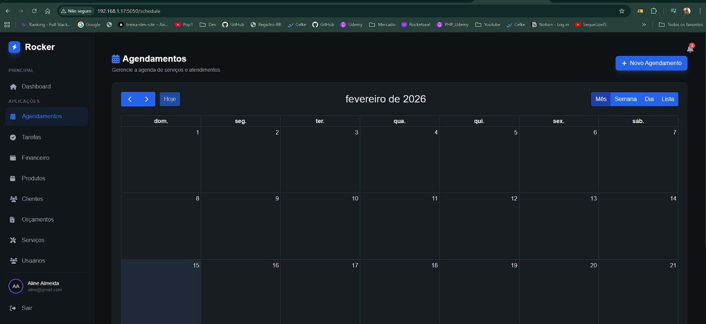
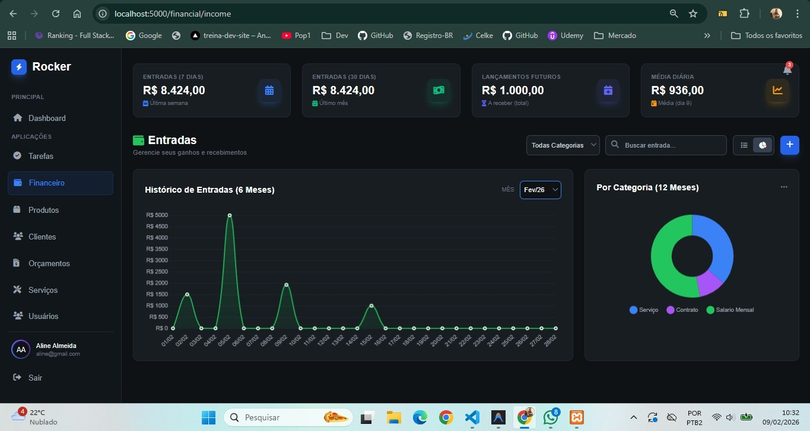
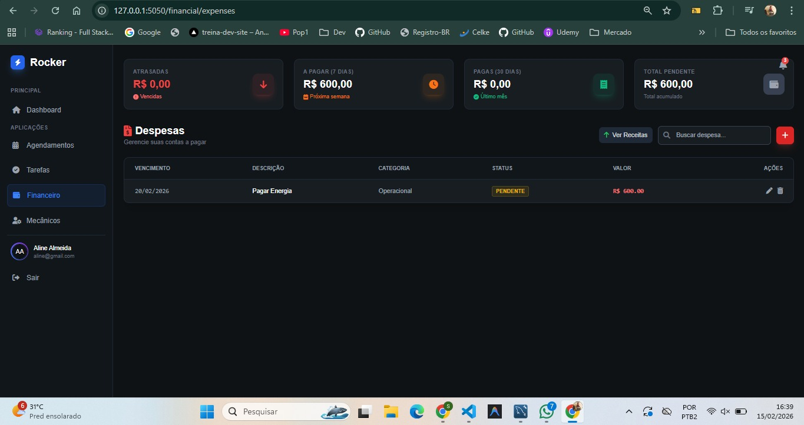
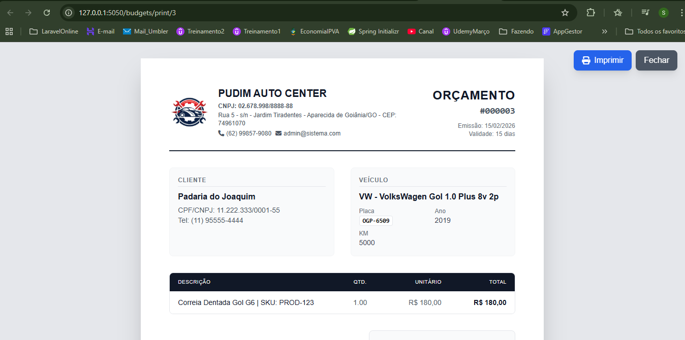

# 🚀🐍 Sistema de Gestão (Flask + MySQL) em VPS Ubuntu

Um projeto **Python + Flask + MySQL** pensado para rodar bem tanto em **DEV** quanto em **PROD**, com um fluxo simples, organizado e seguro. ✨  
Ideal para quem quer um sistema web enxuto, rápido e com deploy em **VPS Ubuntu**. 🧠🖥️


### 🧩 Stack & Tecnologias

- 🐍 **Python**
- 🌶️ **Flask**
- 🐬 **MySQL**
- 🐧 **Ubuntu (VPS)**
- 🧪 **venv** (ambiente virtual)
- 🔐 Boas práticas de **separação DEV x PROD**

---

### 👀 Preview

> * Agendamento  
 <br />

> * Entradas  
 <br />

> * Saídas  
 <br />

> * Orçamento  
 <br />

> * Imprimir  
 <br />

### Migrations

> #### 1. Verifique a Situação Atual
```
python core/db/migration.py status
```

> #### 1.1 Gerar um admin
```
python core/manager/gerar_admin.py
```

> #### 2. Execute o "Stamp" (O Pulo do Gato)
Este comando vai preencher a tabela schema_migrations com todos os arquivos da pasta sql, sem executar o SQL de fato. Ele apenas marca como "Feito".
```
python core/db/migration.py stamp
```

> #### 3. Validação
Rode o status novamente para garantir que tudo ficou verde/ok:
```
python core/db/migration.py status
```

pip install -r core/requirements.txt


### ⚙️ Como rodar o projeto (DEV)

### 1) Clone o repositório 📥
```bash
git clone <URL_DO_REPO>
cd <PASTA_DO_PROJETO>
---

### Politica Oficial de Migrations (Fase 0)

- Fluxo oficial unico: `db/migration.py`.
- Nao execute SQL manual pelos scripts `apply_sql_*`, `fix_migration.py` ou `run_migration_schedule.py`.
- Esses scripts agora sao legados e apenas redirecionam para `python db/migration.py up`.

### Startup da App

- Por padrao, a aplicacao nao executa migration automaticamente no bootstrap.
- Para habilitar auto-migrate no startup (caso excepcional), configure:

```bash
AUTO_MIGRATE_ON_STARTUP=1
```

- Fluxo recomendado em DEV/PROD:

```bash
python core/db/migration.py status
python core/db/migration.py up
python core/manage.py
```

### Estrutura Atual da Raiz

- A raiz do repositorio foi simplificada.
- Ficam na raiz: `setup.py`, `README.md`, `.gitignore` e a pasta `core/`.
- Todo o codigo da aplicacao esta em `core/`.

### Comandos apos reorganizacao

```bash
python setup.py
```

Ou manualmente:

```bash
cd core
python db/migration.py status
python db/migration.py up
python manage.py
```


### Estrutura (Django-like)

```text
core/
  manage.py
  config/
    app.py
    settings.py
    urls.py
    wsgi.py
  apps/
    auth/views.py
    tasks/views.py
    financial/views.py
    ...
  common/
    database.py
    env_loader.py
  db/
    migration.py
    sql/
  templates/
  static/
```

### Compatibilidade

- `core/main.py` permanece como wrapper para `manage.py`.
- `core/migration.py` permanece como wrapper para `db/migration.py`.
- `core/modules/*.py` permanecem como wrappers para `apps/*/views.py`.


